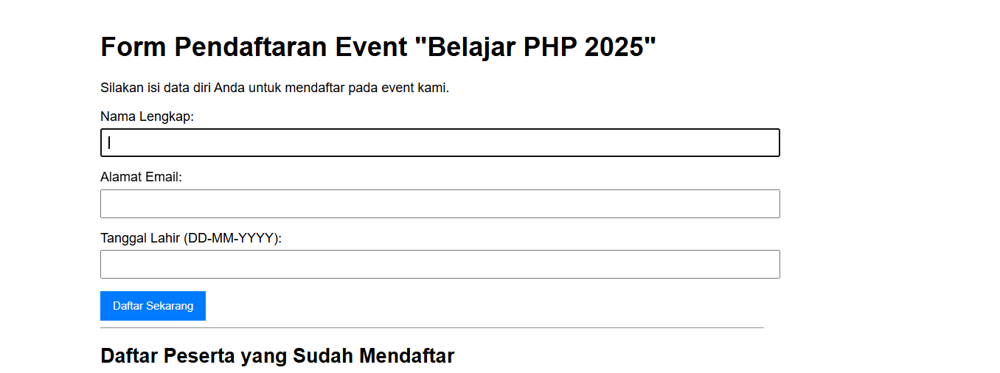
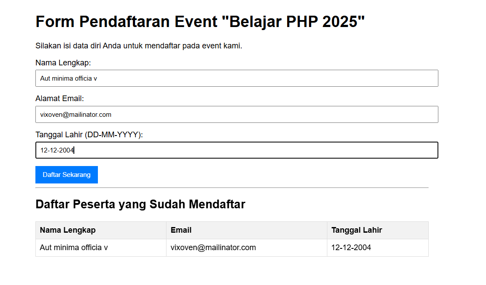
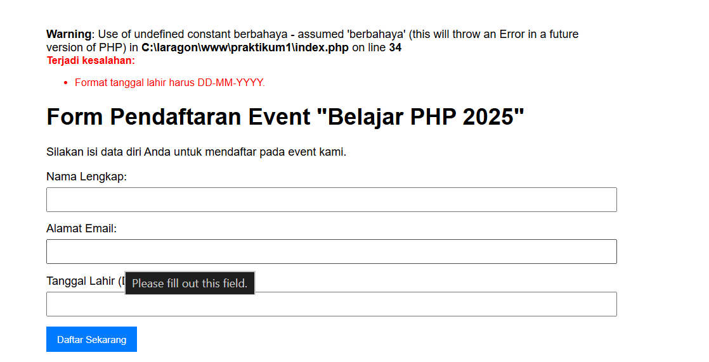

# Praktikum 1: Aplikasi PHP Dasar - Form Pendaftaran Event
Aplikasi ini dibuat untuk memenuhi tugas praktikum dasar PHP. Aplikasi ini
merupakan form pendaftaran sederhana untuk sebuah event fiktif.
## Deskripsi & Fitur
Aplikasi ini mencakup implementasi dari beberapa konsep dasar PHP, yaitu:
- **Variabel, Global Variabel, dan Konstanta**: Untuk menyimpan data dan
konfigurasi.
- **Fungsi**: Digunakan untuk modularisasi kode, khususnya untuk validasi.
- **Penanganan Form (POST)**: Menerima dan memproses data yang dikirim dari
form HTML.
- **Validasi dengan Regex**: Memastikan format input email dan tanggallahir (DD-MM-YYYY) sudah benar.
- **Operasi File**: Menyimpan setiap pendaftar yang valid ke dalam file
`pendaftar.txt`.
- **Menampilkan Data**: Membaca data dari `pendaftar.txt` dan
menampilkannya dalam bentuk tabel.

## Tampilan Aplikasi
**Tampilan Awal Form**

**Tampilan Setelah Pendaftaran Berhasil**

**Tampilan pesan error validasi**
